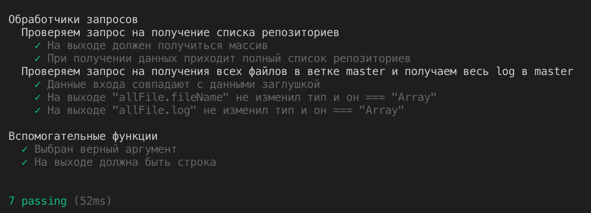

<h1>React Arcanum</h1>

<h2>Запуск приложения React</h2>

Устанавливаем зависимости:<br />

### `npm install`

Запускать проект из корня дирректория:<br />

Сначала запускаем сервер: <br />
Переходим в папку node и от туда запускаем сервер <be />

### `node server.js api/repos`

И командой запустить react приложение: <br />

### `npm start` 

Запустится приложение и откроектся на порту [http://localhost:3000](http://localhost:3000) <br />

<h3>В данной работе реализовал </h3>

<ol>
  <li>Использовал верстку и API из предыдущих домашних заданий</li>
  <li>Переход по страницам происходит без перезагрузки</li>
  <li>При переходе URL страницы меняется</li>
  <li>Можно переходить из одной папки в другую и можно изменять репозиторий. Все происходит без перезагрузки.</li>
  <li>css разделил по компонентно</li>
</ol>

<h3>Не успел реализовать </h3>

<ol>
  <li>Просмотр файлов, в данном приложение можно перемещаться только по папкам. Если перейти в файл то сервер упадет и его нужно будет запускать еще раз.</li>
</ol>

<h2>Запускаем автотесты</h2>

<h3>Интеграционные тесты</h3>

  `npm istrall selenium-standalone --global` <br />
  
   установка [java 13](https://www.oracle.com/technetwork/java/javase/downloads/jdk13-downloads-5672538.html) <br />
   
  `selenium-standalone install`
  
  `npm install hermione --save-dev`
  
  <h4>Запуск автотестов</h4>
  
  Для этого нужно запустить сервер: <br />
  
  Переходим в папку `node` и запускаем сервер командой `node server.js api/repos`<br />
  
  Переходим в корень репозитория и запускаем тесты: <br />
  `selenium-standalone start` <br ?>
  
  `node_modules/.bin/hermione`<br />


<h3>Модульные тесты</h3>

<h4>Запуск тестов</h4>

`npm run unitTest`

### 1)Обработчики запросов

В проекте использовал два обработки запросов `getAllRepos` и `getAllFilesInFolder`, для обработчкив и написал тесты.

Для тестирования в коде добавил `sourceLocation = './../'`, для того чтобы мог прописывать из какой дирректории идет запуск теста относительно обработчиков запроса

<h4>getAllRepos</h4>

```JS
    getAllRepos(req, res, sourceLocation = './../') {
        fs.readdir(sourceLocation + this.path , (err, files) => {
            if(err) return res.send(err)
            const allRepos = files.filter(item => item[0] !== '.');
            res.send(allRepos);
        });
    };
```


<h4>getAllFilesInFolder</h4>

```JS

    getAllFilesInFolder(req, res, sourceLocation = './../'){
        const params = req.params;

        const allInfo = {
            fileName: [],
            log: []
        };

        const checkAnswer = () => {
            if(allInfo.fileName.length > 0 && allInfo.log.length > 0){
                res.send(allInfo);
            }
        }

        if(params['0'].match('tree') || params['2'] === undefined){

            execFile('git' ,
            [`ls-tree`, `-r`, `--name-only`, `${this._checkArg(params.commitHash, 'master')}`],
            {cwd: `${sourceLocation + this.path}/${this._checkArg(params.repositoryId, '')}${this._checkArg(params['3'], '')}`, maxBuffer: 100000000},
            (err, out) => {
                if(err) return res.send(err);
                out.trim().split('\n').map((item, i) => allInfo.fileName.push(item));
                checkAnswer()
            });

            execFile('git' ,
            [`log`, `--name-only`, `--pretty=format:%h:%an:%ar:%s`, `${this._checkArg(params.commitHash, 'master')}`],
            {cwd: `${sourceLocation + this.path}/${this._checkArg(params.repositoryId, '')}${this._checkArg(params['3'], '')}`, maxBuffer: 100000000},
            (err, out) => {
                if(err) return res.send(err);
                out.trim().split('\n').map((item, i) => allInfo.log.push(item));
                checkAnswer()
            });

        } else if(params['2'] !== undefined){
            res.status(404).send('Sorry cant find that!');
        };
    };
```

 <h4>Результаты тестирования</h4>

 